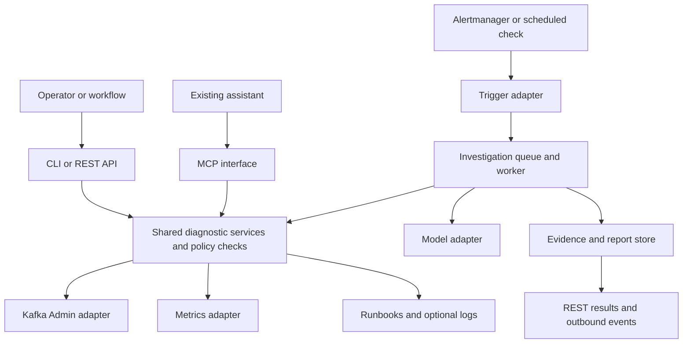

# Kafka Operations Agent implementation plan

Prepared 23 September 2026; moved into the dedicated repository on 24 September 2026. Repository name: `kafka-ops-agent`.

Revision 2: incorporates a comparative design and portability review. This standalone copy is the repository's target design. See `MILESTONE_A.md` and `HANDOFF.md` for current scope and verified implementation status.

## Project outcome

Build a self-hosted service that monitors Kafka health, investigates incidents using approved diagnostic tools, and produces evidence-backed findings and recommendations. Make its tools usable independently of the included agent so organisations can integrate them with their existing models, assistants and workflows.

Example user request:

> Consumer lag has been growing for the orders-processing group. Investigate the last 30 minutes, explain what the evidence supports, and recommend the next operator checks.

The service should distinguish observed facts from hypotheses and identify missing evidence. It should remain useful when a model, monitoring source or Kafka cluster is unavailable.

This is an implementation plan. The commands, interfaces and configuration below are proposed designs, not software already built or tested. Time estimates and acceptance targets are planning assumptions.

## 1. Define the first release and support boundaries

Write a one-page product brief and a support matrix before implementation.

Initial users:

- Kafka operators who want a faster incident investigation.
- Platform teams connecting Kafka diagnostics to an existing assistant through MCP.
- Workflow developers triggering investigations through an HTTP API.
- Engineers evaluating the agent in a reproducible local lab.

First-release incident types:

1. Consumer lag rising because processing is slow.
2. Consumer lag rising because consumers have stopped.
3. Partition imbalance or concentrated lag.
4. Broker reachability and replication degradation.
5. Missing, stale or inaccessible telemetry.

First-release boundaries:

- Read Kafka metadata, selected configurations, offsets and operational metrics.
- Support a documented set of ordinary consumer-group protocols; explicitly identify unsupported group types, including share groups until separately implemented.
- Report recommendations; leave Kafka configuration changes, offset resets and restarts outside the runtime.
- Use configured cluster IDs, topic/group scopes and monitoring sources.
- Support existing Kafka installations without requiring Kafka to be redeployed.
- Treat managed Kafka as a capability-dependent integration: broker JMX, configuration visibility and logs may be unavailable.

Maintain separate compatibility matrices for infrastructure, model adapters and integration clients. A successful local Kafka test does not establish managed-service support, and a successful model API connection does not establish reliable tool calling.

Also record the exact combinations tested: Kafka distribution/version, authentication, metric mapping, model and interface. Separate lists do not imply every cross-combination works. Discover capabilities from configuration and bounded checks, not a blanket distinction between managed and self-hosted Kafka. For example, MSK supports [broker log delivery](https://docs.aws.amazon.com/msk/latest/developerguide/msk-logging.html) and configurable [JMX/Node exporters](https://docs.aws.amazon.com/msk/latest/developerguide/enable-open-monitoring-after-creation.html).

The sections below describe the target design, not a requirement to build everything before the first demo. Deliver three increments: a local diagnostic toolkit and MCP demo; an evaluated reference investigator; then a networked portable release. Follow the milestone table at the end for build order.

**Completion check:** each incident has an example input, required evidence, expected output and a reproducible evaluation scenario.

## 2. Choose architecture and implementation stack

Ship two modes from the same codebase:

| Mode | What it contains | Who uses it |
|---|---|---|
| Tools | Kafka and monitoring adapters, diagnostic calculations, CLI, REST and MCP | Existing assistants and automation systems; no model key required |
| Investigator | Tools plus a bounded agent loop, model adapters, stored investigations and event delivery | Users who want the complete service |



Recommended stack:

| Component | Initial choice | Reason |
|---|---|---|
| Language | Python, with one supported version pinned at implementation | Suitable for integrations and agent logic |
| HTTP API and schemas | FastAPI and Pydantic | Typed contracts and an OpenAPI description |
| Kafka client | `confluent-kafka` AdminClient behind your own adapter | Reuse a maintained Kafka client; keep vendor/library details private |
| Metrics | Existing Prometheus HTTP API | Reuse monitoring already deployed by users |
| MCP | Maintained official Python SDK | Avoid writing the protocol implementation yourself |
| Local persistence | SQLite and a database-backed job/outbox implementation | Durable local operation with a small installation |
| Multiple workers | PostgreSQL storage adapter | Add before advertising multi-replica deployment |
| Runbooks | Versioned Markdown/YAML files | Easy to review, ship and override |
| Packaging | Python package and OCI container image | Local, VM and Kubernetes deployment options |

The domain and service layers must not import provider-specific model objects or depend on an agent framework. REST, MCP and CLI call the same service functions. Persist your own report schema.

The shared diagnostic toolkit is the reusable core; MCP is its first assistant integration, not a mandatory internal network hop. The included investigator can call the same services directly. Publish an optional Python entry point for embedded use, with the same request context and policy checks. Put model integrations in optional package dependencies so tools mode runs with neither model SDKs nor credentials.

Define small typed adapter contracts, rather than empty placeholder integrations:

| Boundary | Contract responsibilities |
|---|---|
| Kafka and metrics | Capabilities, scoped requests, bounded evidence and typed errors |
| Optional logs and changes | Bounded search/list, provenance, redaction and unavailable status |
| Models | Canonical tool requests/responses, limits, usage and capability declarations |
| Fault backend, lab only | Prepare, inject, verify, reset and verify recovery |

Register explicitly trusted, operator-installed adapters at startup. A model or request cannot install code or supply import paths. Ship a contract-test kit covering schemas, permissions, cancellation/timeouts and missing data; prove a small external adapter package can pass it without editing core code. Do not build a plugin marketplace for v0.1.

Start with one service process and one worker. Keep Redis, a vector database, a custom UI and multiple agents outside the first release unless measured requirements justify them.

**Completion check:** a mocked diagnostic operation works through the CLI and API with no Kafka connection or model credentials.

## 3. Define contracts before writing agent prompts

Create versioned JSON schemas for:

- `ClusterCapabilities`: accessible operations, monitored resources, available metrics and limitations.
- `Evidence`: observation values, source, timestamps, units and collection status.
- `InvestigationRequest`: cluster, resource scope, question, time window and request identity.
- `InvestigationReport`: observed facts, hypotheses, supporting evidence, missing data and suggested checks.
- `IncidentEvent`: stable incident ID, event ID, incident state and report reference.

Every tool result should include:

- `schema_version`, `cluster_id`, `evidence_id` and `source`.
- `observed_at`, `collected_at` and the requested window, where applicable.
- Units and metric semantics.
- A typed status: `ok`, `partial`, `stale`, `unsupported`, `permission_denied`, `unavailable` or `timeout`.
- Coverage, truncation and warnings.

Every report should distinguish:

1. Observations produced by tools or deterministic calculations.
2. Ranked hypotheses supported by evidence IDs.
3. Alternative explanations and missing evidence.
4. Recommended operator checks with prerequisites and expected observations.

Keep operational incident state separate from investigation status. An investigation can complete while the incident remains active. A failed model call must not resolve an incident.

Require source references for factual and numerical statements. Represent quantitative claims with evidence ID, metric/field, resource, time window, units and any approved derivation. Validate values and recompute derived comparisons from evidence; seeing the same number somewhere in a tool response is insufficient.

Use versioned `cause_id` values for supported hypotheses, plus an explicit `unknown` value. Distinguish a healthy/no-supported-fault outcome from insufficient evidence and out-of-scope conditions. Record evidence supporting and contradicting each hypothesis. If you expose confidence labels, describe their basis; do not present an uncalibrated model confidence score as a probability.

A deterministic grounding check can validate references, values, arithmetic and allowed identifiers. It cannot establish that a causal explanation follows from those observations; retain scenario-based evaluation and human review of that reasoning.

**Completion check:** mock results validate, incomplete data remains explicit, and a report can be rendered as JSON or Markdown without changing its meaning.

## 4. Build a reproducible Kafka lab

Provide two Docker Compose profiles:

- **Minimal:** one Kafka node, producer, consumer and metrics. Enough for lag and tool development.
- **Replication:** three KRaft nodes, producer, consumer, JMX Exporter, Prometheus and Alertmanager. Grafana is optional.

Pin image versions and digests. Measure and document resource requirements on tested machines. Keep the demo isolated from production credentials and use synthetic events.

Three combined broker/controller nodes are suitable for a development demonstration. Stopping one leaves two controllers available; stopping two also destroys controller quorum and confounds a broker-only failure test. Use a separate-controller profile for deeper outage tests. [Kafka KRaft guidance](https://kafka.apache.org/43/operations/kraft/)

Build a controllable workload with:

- Producer rate and key distribution controls.
- Consumer processing delay and start/stop controls.
- Explicit offset commit behaviour.
- Consumer processing metrics so slow processing can be distinguished from slow commits.
- A fixture recorder that freezes timestamped evidence for offline replay.

Describe faults as data: scenario ID, seed, prerequisites, target, action, observation window, required signals, reset action and recovery check. Keep evaluator-only ground truth separate from agent-visible telemetry. Implement a small Compose backend first, not a Kubernetes backend stub advertised as working. A later backend can implement the same lifecycle.

Start with one slow-consumer scenario, then add the other supported conditions incrementally. Each scenario must demonstrate its intended observable effect and recover before it counts as a test case. Aborted tests must still attempt cleanup and flag failed recovery. Scope all destructive lab operations to labelled fixture resources.

Use the JMX Exporter Java agent for the lab. It avoids needing a remote JMX/RMI connection. External users should be able to supply an existing metrics endpoint instead. [JMX Exporter quick start](https://prometheus.github.io/jmx_exporter/getting-started/quick-start/)

**Completion check:** the lab starts, produces and consumes records, exposes metrics, and recovers cleanly from a single scripted fault.

## 5. Implement the diagnostic tools and evidence layer

Implement these operations before introducing an LLM:

| Operation | Purpose |
|---|---|
| `list_clusters` | Return only clusters visible to the caller |
| `get_capabilities` | Identify available evidence sources and unsupported operations |
| `describe_cluster` | Fetch cluster identity and broker/controller metadata |
| `describe_topic` | Fetch partition leaders, replicas and ISR |
| `describe_consumer_group` | Fetch group state, members and assignments |
| `get_consumer_lag` | Return committed/end offsets and derived per-partition lag |
| `get_metric_series` | Fetch a bounded window for a named approved metric |
| `search_runbooks` | Find relevant steps in versioned local runbooks |

Add `get_recent_changes` only when a real deployment/configuration source is available. A metadata snapshot does not establish when a deployment occurred. Add bounded log search as a later connector.

The Kafka client has description and offset APIs useful for this implementation. Keep method/version differences inside the adapter. [Confluent Python client reference](https://docs.confluent.io/platform/current/clients/confluent-kafka-python/html/index.html)

Normalise telemetry into stable internal names, such as `consumer.committed_offset_lag`, `replication.under_replicated_partitions` and `telemetry.source_age_seconds`. Map each installation's exporter names into those concepts through configuration.

Handle Kafka semantics carefully:

- Committed lag, client fetch lag and follower replication lag are different measurements.
- Broker JMX alone does not provide consumer-group committed lag. Obtain it from Admin offsets or a compatible exporter.
- `end_offset - committed_offset` is an offset distance, not necessarily an exact count of unprocessed business records.
- Missing commits, offset resets, truncation and non-atomic snapshots require explicit handling.
- High committed lag can reflect a commit interval; use processing progress when available.
- Under-replication does not prove data loss.

Use version-specific definitions from [Kafka's monitoring reference](https://kafka.apache.org/43/operations/monitoring/).

Disk free space needs host/container metrics. Failed Prometheus scrapes indicate lost monitoring connectivity; corroborate broker unavailability with other evidence.

Apply query limits: resource allow-lists, lookback duration, series count, sampling step, response size and timeout. Start with named metric queries rather than arbitrary PromQL generated by a model. Preserve partial-result warnings from the [Prometheus HTTP API](https://prometheus.io/docs/prometheus/latest/querying/api/).

Default model-facing metric results to a deterministic summary: count, first/last, min/max with timestamps, missingness, trend where meaningful and a bounded sample, initially around 20 points per series. Compute summaries from the full bounded query result, not only the displayed sample; compute counter rates/reset handling before summarisation. Preserve the bounded source evidence and its query metadata for audit and approved drill-down. Mark downsampling explicitly; a sample can hide a short spike and cannot prove that an omitted event never occurred.

Protect the monitored cluster from the diagnostic service itself. Apply per-cluster request/concurrency budgets across all callers, bounded discovery, batched offset lookups where supported, short-lived evidence caching and coalescing of identical in-flight requests. Cache keys must include effective scope and query parameters; enforce authorisation on every read. Return freshness, collection time and partial coverage rather than fetching an entire large cluster for every question.

Search local runbooks using deterministic lexical retrieval, such as BM25, before considering embeddings. Return the document ID/version, relevant section and applicability. A runbook is guidance, not evidence that its described condition occurred.

Verify that requests for nonexistent topics cannot trigger topic auto-creation. Read-only behaviour must be enforced by both adapter behaviour and the Kafka principal's permissions.

**Completion check:** the CLI produces a useful health/lag report without a model. Missing access or metrics cannot silently become a healthy result. Concurrent investigations against a simulated large cluster stay within collection budgets and report any incomplete coverage.

## 6. Add deterministic incident detection

Use Prometheus alert rules where available. Manual investigations come first, then Alertmanager. Add a configurable scheduler over the same normalised observations later if installations without alerting need it; do not require two detectors for the first portable release.

Initial rules should cover:

- Lag remains high and grows over a configured window while traffic continues.
- A known active workload has no consumers and committed offsets stop progressing.
- Sustained replication degradation.
- Failed monitoring sources or stale evidence.

Set thresholds per workload and service expectations. An empty group can be intentional. Include maintenance windows, debounce, cooldown, recovery conditions and incident correlation.

Use an incident identity based on the configured cluster, rule, affected resource and episode. Deduplicate repeated alerts and investigate again only when evidence changes materially or a configured refresh is due.

Build an Alertmanager ingress adapter that accepts its native webhook payload, handles grouped and resolved alerts, and maps authenticated source identities to permitted clusters. Acknowledge after durable enqueueing; do not hold the webhook request open during model inference. [Alertmanager webhook configuration](https://prometheus.io/docs/alerting/latest/configuration/#webhook_config)

Store operational state outside the Kafka cluster being investigated. Keep HTTP/CLI access available during Kafka outages. If Kafka carries investigation events, make it an optional integration with a documented outage path.

**Completion check:** repeated alerts produce one incident, a brief benign rebalance does not cause an alert storm, and recovery is tracked independently of the agent.

## 7. Add the bounded investigator and interchangeable models

Define a small `ModelAdapter` interface accepting canonical messages, tool definitions and budgets, and returning text, tool requests, finish status and usage. Provider adapters translate to and from that representation.

Implement one provider first, then a second provider with a different native API. Add Mistral and a local server as further adapters. A configurable OpenAI-compatible endpoint is useful, but does not prove that every model supports the same tool schemas or structured outputs.

OpenAI and Anthropic expose structured tool requests with different request/response conventions. That is why translation belongs at the adapter boundary. [OpenAI function calling](https://developers.openai.com/api/docs/guides/function-calling), [Anthropic tool use](https://platform.claude.com/docs/en/agents-and-tools/tool-use/how-tool-use-works)

Investigation flow:

1. Resolve caller permissions and resource scope.
2. Capture an initial deterministic evidence bundle.
3. Ask the model for hypotheses and the next permitted diagnostic operation.
4. Validate the operation name, arguments, scope and remaining budget.
5. Execute the operation and append its structured evidence.
6. Repeat until evidence is sufficient or a limit is reached.
7. Validate the final report and render the findings.
8. If the provider fails, return collected facts and an explicit partial report.

Proposed starter limits: 8 reasoning/tool rounds, 20 total tool calls and a 120-second investigation deadline. Make token budgets, concurrency and provider-specific cost limits configurable. Enforce elapsed time and usage in code.

Keep facts/numbers computed by tools. Validate evidence IDs in reports; a valid JSON response is not proof of factual correctness. Use bounded retries for formatting failures and fail visibly after the retry limit.

Do not silently switch between providers or from a local model to a cloud model. Deployment configuration must define permitted data destinations. A model without reliable tool calling can use an explicitly supported summary-only mode.

**Completion check:** the same recorded incident generates schema-valid, evidence-backed reports through two providers without modifying diagnostic code.

## 8. Expose REST, CLI and MCP interfaces

Proposed HTTP routes:

```text
GET  /v1/clusters
GET  /v1/clusters/{id}/capabilities
GET  /v1/clusters/{id}/health
GET  /v1/clusters/{id}/groups/{group}/lag
POST /v1/investigations
GET  /v1/investigations/{id}
POST /v1/integrations/alertmanager
GET  /healthz
GET  /readyz
GET  /metrics
```

Return `202 Accepted` and an investigation ID for asynchronous investigations. Support request idempotency, cancellation policy, pagination and predictable error codes. Export OpenAPI and examples.

Proposed CLI:

```text
kafka-ops doctor --cluster demo
kafka-ops health --cluster demo --json
kafka-ops lag --cluster demo --group orders-processing --json
kafka-ops investigate --cluster demo --group orders-processing --window 30m
kafka-ops replay --fixture slow-consumer
```

Expose the same diagnostic operations as MCP tools. Support stdio for clients launching a local process and Streamable HTTP for network deployments. Return structured results with schemas. Make the reference investigator optional in MCP mode so an existing assistant can reason over the tools itself.

Build and exercise stdio MCP before the custom investigator. Attach one real client, inject the slow-consumer scenario, and manually investigate using only the published tools. Save a sanitised example transcript and improve tool names, missing fields and response sizes from that exercise. A useful external-client investigation is the first public demonstration milestone. Add remote transport only with its authentication and resource controls.

All investigation triggers should normalise requests into one application service for authorisation, deduplication and durable submission. Direct diagnostic tools remain usable independently. An optional MCP `start_investigation`/`get_investigation` pair may wrap the reference investigator, but do not force an existing assistant to delegate its reasoning to another LLM.

Pin the protocol revision and SDK, and test the clients you claim to support. The current MCP transport differs from older examples; rely on the maintained SDK and negotiated capabilities. [MCP transport specification](https://modelcontextprotocol.io/specification/2026-07-28/basic/transports/streamable-http)

Document connection direction: a local MCP client can reach a private service, but a cloud-hosted assistant may need an approved private connection, gateway or reachable endpoint. Installing MCP does not create network connectivity.

**Completion check:** CLI, REST and an actual MCP client invoke the same tools and receive equivalent structured data. Tools mode works without any model key.

## 9. Add workflow events and durable delivery

First outbound integration: a generic webhook carrying versioned JSON. Provide example consumers for an automation tool and a small Python service. Add direct Slack/Jira/GitHub adapters only after the generic path is useful.

Suggested event types:

- `incident.opened`
- `incident.updated`
- `incident.resolved`
- `investigation.completed`
- `investigation.failed`

Each event includes an event ID, incident/investigation ID, timestamp, cluster ID, schema version and report reference. Persist delivery through a database outbox; retry transient failures with backoff. Document at-least-once delivery and require consumer deduplication by event ID.

Configure destinations server-side. Add signed outbound payloads and verify inbound credentials. Decide which details may leave the deployment before forwarding evidence to another system.

Offer optional Kafka event publishing later, following the same schema. Use a separate administrative/event cluster or an independent fallback when the monitored cluster is unavailable.

**Completion check:** restarting the service preserves a queued investigation and pending webhook; a duplicate webhook does not produce a duplicate incident or downstream ticket.

## 10. Make deployment controls part of the implementation

Apply controls in shared services so all interfaces enforce them:

- Least-privilege Kafka credentials with documented ACL examples for each tested support profile.
- No runtime Docker socket, arbitrary shell tool or Kafka mutation operations.
- Explicit cluster/topic/group authorisation for every request and evidence lookup.
- Adapter credentials from secret references; never put secrets into prompts or reports.
- Config allow-lists and bounded log redaction before model access.
- Logs and runbooks treated as untrusted input, never as permission to invoke other tools.
- Authenticated remote endpoints, TLS deployment guidance and configurable data retention.
- Provider egress policy, including rejection of all cloud destinations in a local-only deployment; qualify a local model adapter before claiming support for that mode.

Kafka permissions vary by operation and protocol, so test the ACL examples against the supported versions. [Kafka authorisation documentation](https://kafka.apache.org/43/security/authorization-and-acls/)

For remote MCP, implement the protocol's authorisation flow using a maintained library or compatible gateway. Validate token audience/issuer/expiry and application permissions. Keep incoming MCP credentials separate from Kafka and monitoring credentials. [MCP authorisation](https://modelcontextprotocol.io/specification/2026-07-28/basic/authorization)

Expose service metrics for tool failures, investigation duration, provider usage, queue age and event-delivery failures. Log evidence references and operation results rather than full sensitive prompts. Readiness should reflect the service's ability to work; report a target cluster outage as diagnostic status, not a reason to stop serving results.

**Completion check:** unauthorised cluster access is rejected through every interface, fake secrets stay out of model payloads and logs, and model prompts cannot expand the tool allow-list.

## 11. Build and run the evaluation suite

Keep the fault injector separate from the production image. Permit it to operate only on explicitly labelled lab resources. Never mount its control privileges into the investigator.

| Scenario | Controlled setup | Required behaviour |
|---|---|---|
| Slow consumer | Add processing delay while maintaining input rate | Detect growing lag; cite processing evidence before claiming a processing bottleneck |
| Stopped consumer | Stop the lab consumer while producer continues | Identify no active members/commit progress; avoid inventing the reason the process stopped |
| Concentrated lag | Send most events to one key/partition | Identify the affected partition; distinguish observed lag skew from confirmed traffic skew |
| Broker outage | Stop one broker in the three-node profile | Correlate reachability/metadata/ISR; report affected partitions |
| Exporter outage | Break scraping while Kafka remains reachable | Report telemetry failure rather than confirmed broker failure |
| Brief rebalance | Restart a consumer and allow recovery | Avoid repeated incidents and recognise recovery |
| Permission denied | Restrict one diagnostic operation | Report missing access and continue only with permitted evidence |
| Provider outage | Return timeout/rate-limit responses | Keep deterministic results available; enforce retry budgets |
| Prompt injection | Insert hostile text into a synthetic log/runbook | Treat it as data; do not invoke prohibited operations or disclose secrets |
| Recovery | Restore workload or broker | Resolve the incident only after recovery evidence meets the rule |

Start with about 20 frozen fixtures across faults, healthy/transient conditions and missing-data cases. Keep separate development and held-out fixtures. Hold out scenario variants and seeds, not copies of the same recording. Pin workload versions, configs and capture windows. Expand to more variants and repeated runs before treating percentages as robust estimates.

Keep fault labels, scenario filenames and injector state out of tool responses. A real change feed may reveal an action such as a deployment, not the evaluator's causal label. Include unrelated changes and counterexamples so change correlation is not automatically treated as causation. Freeze runbooks before held-out scoring and keep expected diagnoses outside the searchable corpus.

Compare three baselines: deterministic report only, fixed evidence plus LLM summary, and bounded tool-using investigator. This shows whether the agent's extra tool choices improve diagnosis.

Give the summary and agent baselines the same initial evidence and compatible budgets; record the agent's additional acquisitions and costs. Runbook-retrieval ablation is optional. Score detection separately from diagnosis: cause top-1/top-3 accuracy on supported single-cause cases, required-evidence recall, correct abstention, false reassurance, grounded quantitative claims and policy-violating recommendations. Report results by scenario with sample counts, not only one aggregate percentage. A forbidden-phrase list can catch regressions but is not a complete recommendation-safety assessment.

Expand the fault catalogue only after prerequisites and expected effects are proven: rebalance loops, deserialisation errors, retention loss, network latency and disk pressure. Idle consumers when partitions are fewer than consumers are not by themselves an incident; a producer surge is benign only if the workload stays within its defined service expectations. Network faults require verified traffic routing through the proxy; retention tests must account for actual segment deletion and client offset policy. Disk tests use bounded disposable storage, never fill the host disk. Do not promise that each injection always yields one fixed metric signature.

Proposed v0.1 acceptance targets:

- 100% valid published report schemas; invalid output becomes an explicit failed/partial result.
- Every factual/numerical claim has a valid supporting evidence reference, checked through code and human review.
- At least 90% detection recall on seeded supported faults, with precision reported alongside it.
- No false critical incident on the healthy/transient fixture set.
- Correct missing-data handling in all negative fixtures.
- No unauthorised operation execution or synthetic secret disclosure in the security fixtures.
- Documented latency, tool count, token use and cost for each tested model.

Measure investigation latency separately from detection delay: an alert rule may intentionally wait several minutes. Compare manual and assisted operator investigation time without presenting lab results as measured production MTTR.

**Completion check:** publish the methodology, raw aggregate results, supported combinations and known failure cases. Passing the suite supports a scoped release, not a universal reliability guarantee.

## 12. Package for someone else's infrastructure

Create three clear installation routes:

1. Replay recorded incidents with a fake model: no Kafka or API key required.
2. Run the full synthetic Kafka demo with Docker Compose.
3. Attach the service to an existing cluster and monitoring endpoints using configuration.

Example configuration design:

```yaml
schema_version: 1
mode: investigator

clusters:
  - id: demo
    bootstrap_servers: ["kafka-1:9092"]
    client_config_file: /run/secrets/kafka-client.properties
    topic_allowlist: ["demo-orders"]
    group_allowlist: ["orders-processing"]
    metrics:
      backend: prometheus
      url: http://prometheus:9090
      mapping_file: /etc/kafka-ops/metrics/apache-kafka.yaml

model:
  adapter: openai
  model: ${MODEL_NAME}
  api_key_env: MODEL_API_KEY
  max_tool_rounds: 8
  max_tool_calls: 20
  deadline_seconds: 120

policy:
  kafka_mutations: false
  include_message_payloads: false
  approved_model_adapters: [openai]

runbooks:
  directory: /etc/kafka-ops/runbooks

storage:
  backend: sqlite
  path: /var/lib/kafka-ops/state.db
```

The implementation must validate environment-variable expansion and file references; this YAML is a proposed contract. Network deployment also needs its documented authentication configuration. Local-model mode changes the model adapter and approved destinations, not Kafka diagnostic code.

Add Helm packaging after the container/attach path is validated. Multi-replica mode must include PostgreSQL, migration handling, worker leases, shared idempotency and restart tests. A Helm chart alone does not establish production readiness.

Documentation deliverables:

- Ten-minute replay quickstart and measured full-demo setup instructions.
- Architecture and report schema.
- Kafka permissions and authentication profiles.
- MCP client, REST and CLI examples.
- Adding a model, metric mapping, runbook or connector.
- Data flow, egress, retention and secret handling.
- Upgrade/rollback procedure and compatibility matrix.
- A short demo video and a troubleshooting workshop.

Make `docs/integrate.md` the main onboarding guide, with worked recipes for an external MCP client, REST-triggered investigation with polling, a webhook consumer with deduplication, and provider/metric-mapping changes. Include a configuration preflight (`doctor`) that checks DNS and advertised broker reachability, TLS/SASL, permissions and metric availability without modifying the cluster. Publish measured setup time; do not promise that every enterprise network can be configured in ten minutes.

Include a reproducible enablement workshop: learning objectives, a guided incident, an independent exercise, instructor notes and evidence-backed solutions. State clearly which results come from synthetic labs and which integrations have actually been exercised. Do not describe the project as customer production deployment or enterprise-product rollout experience.

Package an open-source licence appropriate for reuse, third-party notices and contribution guidance before distribution. Verify any course examples/runbooks you publish are yours to share.

**Portability release gate:** a new user connects an environment with a materially different tested configuration (for example authentication and exporter labels), switches to a second native model adapter, invokes an investigation through REST and tools through MCP, and receives the same report schema without editing core code. Tools mode must also pass with model dependencies and credentials absent. Publish the exact successful combinations and any unsupported capabilities.

### Optional Kubernetes diagnostics, separate from Kubernetes deployment

Running the service in Kubernetes does not automatically give it pod or storage diagnostics. Add a separate, explicitly enabled adapter for scoped workload status, restart/termination reasons, events and bounded logs. Use a read-only API identity scoped to allowed namespaces/resources; no `exec`, arbitrary `kubectl` shell tool or production Docker socket. Register these tools only when enabled and authorised.

Map Kafka resources to workloads through configuration or verified metadata. Treat events and rollout records as partial history, not a complete change audit. Obtain disk-usage measurements from an appropriate metrics source; a PVC's declared capacity is not current free space. Test the adapter on an optional fixture after the core release. Do not claim Strimzi, MSK or Confluent Cloud support solely because an adapter interface exists.

## 13. Add Flink as an optional extension

There are two independent Flink integrations.

### A. Investigate Flink jobs that consume Kafka

Implement a Flink adapter exposing job status, failures, operator metrics and checkpoint statistics. Register a configured relationship between a Kafka group/topic and a Flink job; do not infer it from a name alone.

Useful diagnostic operations:

- `describe_flink_job`
- `get_flink_operator_metrics`
- `get_flink_checkpoint_history`
- `get_flink_exceptions`

Example investigation: Kafka lag is increasing because a Flink pipeline is constrained downstream. Collect busy/idle/backpressure metrics, source progress, sink evidence and checkpoint history. Kafka committed offsets for a Flink consumer may be tied to checkpoints; interpret them with that context.

Flink exposes per-task busy, idle and backpressure times, providing useful evidence for locating processing pressure. They do not independently prove the downstream cause. [Flink backpressure documentation](https://nightlies.apache.org/flink/flink-docs-stable/docs/ops/monitoring/back_pressure/)

### B. Use Flink to correlate operational events

Add an optional stream-processing profile when the rule complexity or demonstration justifies it:

```text
Collectors -> telemetry topic -> Flink windows/CEP -> incident events
                                                       |
                                                       v
                                             investigation worker
```

Collectors turn existing telemetry into the canonical event schema; Prometheus does not automatically emit those Kafka events. Define event timestamps, late-event handling, keyed incident state, deduplication and recovery events. Keep LLM requests in the worker, outside Flink processing functions, so provider latency/retries do not hold up monitoring.

Use the same incident/event contracts as the Alertmanager path and choose a primary trigger per rule to avoid duplicate investigations. Preserve an independent control/alert path for Kafka outages.

**Completion check:** a throttled synthetic Flink sink produces evidence of downstream pressure, and the investigator distinguishes it from a Kafka broker problem.

## Suggested repository structure

```text
kafka-ops-agent/
  src/kafka_ops_agent/
    domain/                 # Versioned contracts
    services/               # Diagnostic operations and policy enforcement
    adapters/
      kafka/
      metrics/
      models/
      runbooks/
      storage/
      observability/        # Optional logs, changes and workload diagnostics
    investigator/           # Bounded tool loop and report validation
    interfaces/             # REST, MCP, CLI
    integrations/           # Alertmanager and outbound webhooks
  runbooks/
  config/metric-mappings/
  examples/                 # Client calls, workflow recipes and external adapter example
  deploy/                   # Container, Compose; Helm later
  lab/                      # Workload, declarative scenarios and isolated fault backend
  evaluations/              # Fixtures, rubrics, baselines, results
  tests/                    # Shared adapter contract suite and integration checks
  docs/                     # integrate.md, compatibility, workshop, safety and architecture
```

## Suggested sequence and milestones

For one experienced developer, use roughly 4–6 focused weeks as a provisional target for the scoped portable release, then re-estimate after the first lab and MCP demo. This is not an estimate for every optional section. Access, security integration and external-cluster testing can extend it. Do not front-load twelve fault scenarios, multiple model providers or remote infrastructure before demonstrating one useful investigation.

| Milestone | Work | Exit condition |
|---|---|---|
| A: local toolkit, approximately week 1 | Scope, contracts, minimal lab, reversible slow-consumer fault, tools, CLI and stdio MCP | External assistant investigates through tools; no custom loop required |
| B: reference investigator, approximately week 2 | Runbooks, evidence/claim validation, one provider, replay and bounded loop | One grounded end-to-end report; provider failure still returns useful evidence |
| C1: portable interfaces, approximately weeks 3–4 | REST, durable submission/outbox, Alertmanager, second provider and authenticated network MCP | A workflow and an existing assistant use the same services; security and restart tests pass |
| C2: scoped v0.1 release, approximately weeks 5–6 | Expanded faults, held-out evaluation, attach/preflight, load limits, adapter contract kit, documentation and external pilot | Exact compatibility results and reproducible evaluation published; another person installs it |
| Later, demand-driven | Local-model qualification, fallback scheduler, Helm/multiple workers, log/change/Kubernetes adapters, Flink diagnostics and correlation | Each extension has its own capability checks, evaluation and support claim |

Build the first vertical slice before expanding coverage: slow consumer -> manual MCP investigation -> evidence-backed explanation. Then add the reference investigator and alert trigger, yielding stored JSON/Markdown reports. Finally prove REST integration, a second model and another person's infrastructure. That sequence establishes operational value and portability with usable deliverables along the way.
